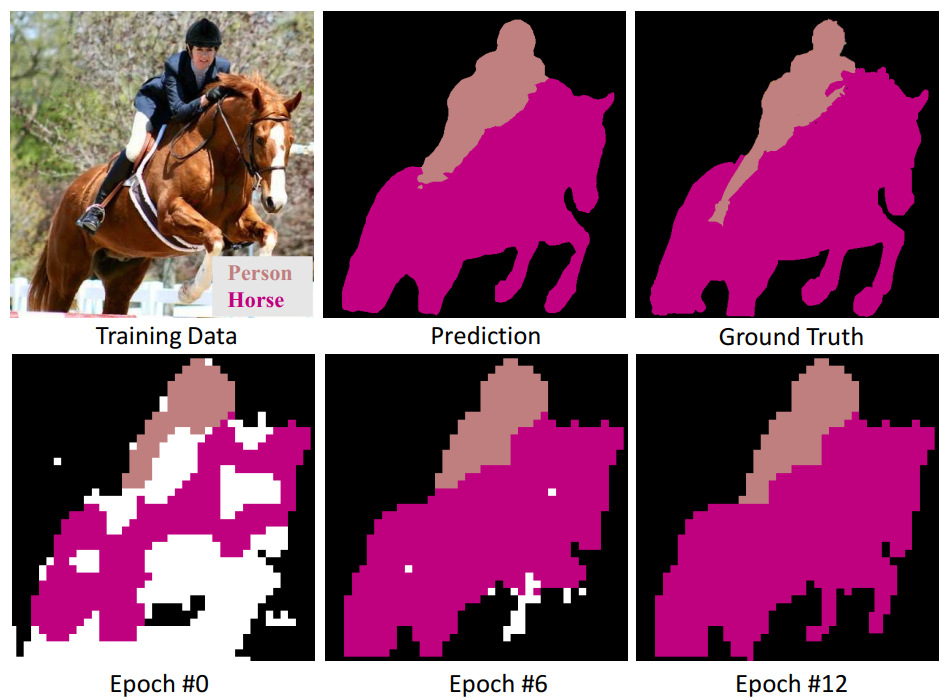
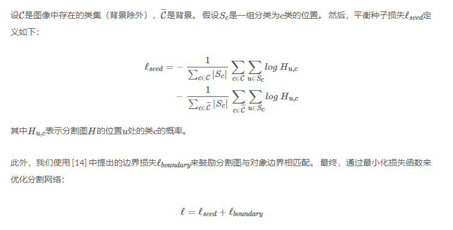
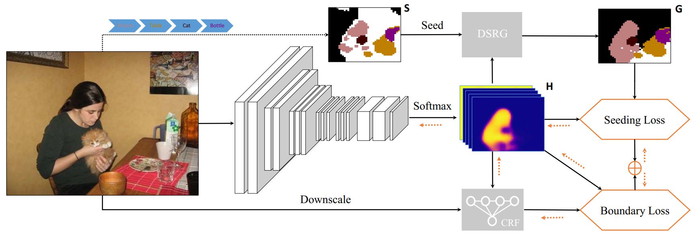
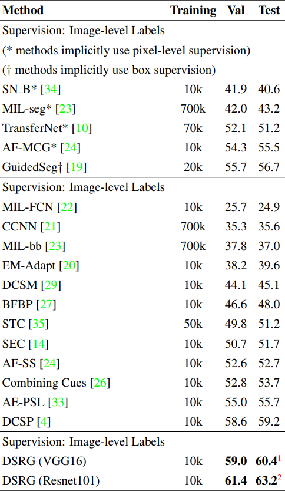
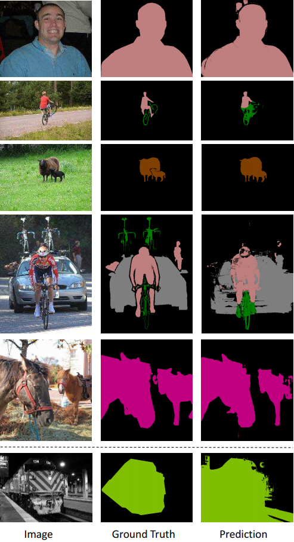
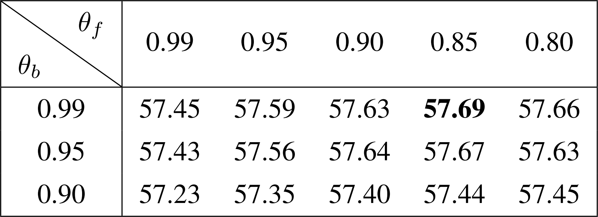
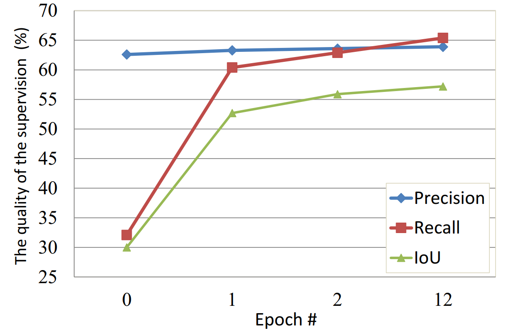

### when

* cvpr18

### what

* 本文研究了仅使用图像级标签作为监督来学习图像语义分割网络的问题，这一点很重要，因为它可以显着减少人类的标注工作。
* 最近关于该问题的最新方法首先使用深度分类网络推断每个对象类的稀疏和鉴别区域，然后使用鉴别区域作为监督来训练语义分割网络。
* 在种子区域扩展的传统图像分割方法的启发下，我们提出从鉴别区域开始训练语义分割网络，逐步增加种子区域扩展的像素级监督。种子区域扩展模块集成在深度分割网络中，可以从深层特征中受益。
* 与具有固定/静态标签的传统深度网络不同，所提出的弱监督网络使用图像内的上下文信息生成新标签。所提出的方法明显优于使用静态标签的弱监督语义分割方法，并获得最先进的性能，在PASCAL VOC 2012测试集上获得63.2％的mIoU分数，在COCO数据集上获得26.0％的mIoU分数。

### why 提出

* 由于大量的完全标注图像，深度卷积神经网络（DCNN）在图像语义分割问题上取得了巨大的成功[5,18]。
*  然而，收集大规模精确的像素级标注是耗时的并且通常需要大量的金融投入。 然而，未标记和弱标记的视觉数据可以以相对快速且廉价的方式大量收集。 因此，计算机视觉研究的一个有希望的方向是开发可以从未标记或弱标记的图像中学习的对象识别方法[14,32]。

* 在本文中，我们研究了从弱标记图像学习语义分割网络的问题。 在弱标签的各种设置中，图像级标注是最经济和最有效的设置之一。 在这种情况下，每个训练图像都有其图像类/类别标签。 这意味着属于类标签的对象出现在图像中。 但是，对象的位置是未知的。 我们需要推断对象的像素级位置。 因此，训练弱监督语义分割网络的主要问题是如何准确地将图像级标签分配给它们对应的像素。

* 为了在训练中建立所需的像素标签对应关系，有一项非常有见地的研究工作。 Kolesnikov等人 [14] 采用图像分类网络和分类激活图（CAM）[37]方法来选择最具鉴别力的区域，并将这些区域用作分割网络的像素级监督。 与早期的弱监督语义分割方法[22,20]相比，基于鉴别区域的方法显着改善了这一具有挑战性的任务的性能。 然而，在[14]中，鉴别区域是小而稀疏的，如图1中的epoch #0图像所示。在训练中，语义分割网络的监督被固定为稀疏鉴别区域。 因此，我们将[14]中的学习策略命名为“静态监督”。 静态监督设置偏离了语义分割任务的要求，需要准确和完整的对象区域来训练分割模型。

* 为了解决这个问题，我们建议在训练分割网络中扩展鉴别区域以覆盖整个对象。实际上，鉴别区域周围的像素总是属于相同的对象，因为同一对象的语义标签具有空间连续性。我们的动机是，使用图像标签能够从感兴趣的对象中找到小而稀疏的鉴别区域，称为“种子线索”，具有相似特征（例如颜色，纹理或深度特征）的种子线索的相邻像素可能具有与种子线索相同的标签。我们利用经典的种子区域增长（SRG）方法 [1] 对此过程进行建模，以生成准确完整的像素级标签。在这里，我们可以在像素级标签的监督下训练语义分割网络。与 [14,19] 不同，像素级标签是动态的。动态监督与使用固定监督的传统网络训练有很大不同。在我们的例子中，我们让网络生成输入训练示例的新标签，即训练图像。 SRG已集成到深度分割网络中，可以端到端进行优化，并享有深层功能。我们将所提出的方法命名为“深度种子区域扩展（DSRG）”，用于弱监督语义分割。

### where （改进点）

* 在训练中，由分类网络定位的种子线索很小但具有高精度。 选择种子线索作为SRG中的种子点是一种自然的方式。 此外，为了测量种子点和相邻像素之间的区域扩展相似性，我们利用分割网络输出的分割图作为特征。 因此，SRG将种子线索视为初始种子点; 然后，在其对应类别上具有高概率的分割图中的相邻像素采用与种子线索相同的标记。 重复该过程直到没有满足上述约束的像素。 最后，DSRG的输出用作训练分割网络的监督。 在训练阶段，监督用于形成损失函数，称为“种子损失”。 在种子区域，损失与[5]中的完全监督损失函数相同；种子损失忽略了其他位置。

* 在训练期间，DSRG方法逐渐丰富了分割网络的监督信息。 如图1所示，epoch #0中的监督实际上是由分类模型生成的种子线索，提示定位人和马的头部，这是图像中最具鉴别力的区域。 随着epoch的增加，动态监督逐渐接近真实情况并准确地覆盖整个对象内容。 同时，动态监督使网络产生竞争性的分割结果。 为了确保训练的稳定性，DSRG始终选择原始种子线索作为初始种子点。

* 在实验中，我们证明了我们的方法对具有挑战性的PASCAL VOC 2012语义分割基准 [8] 和COCO的有效性，并表明我们实现了最先进的最新结果。 此外，我们通过进行一些模块研究来提供DSRG方法的分析。

* 总之，本文的主要贡献总结如下：
  * 在深度语义分割网络中，我们利用种子区域扩展 [1] 机制，使网络能够安全地生成新的像素级标签，用于弱监督语义分割。 此外，网络可以端到端的方式进行优化，易于训练。
  * 我们的工作在PASCAL VOC分割基准和COCO数据集上获得了最先进的弱监督语义分割性能。 我们方法的mIoU分别在PASCAL VOC验证集和测试集上分别为61.4％和63.2％，优于许多复杂系统，并且越来越接近全监督的分割系统 [6]（67.6/70.3％ mIoU 在验证集/测试集）。

### who（以前的方法，谁受到影响）

#### 1. 图像级别监督的像素标签

* Pinheiro等人 [23] 提出了一种新颖的LSE池化方法，它更加重视像素，这对于在训练期间对图像进行分类非常重要。 Papandreou等人 [20] 采用基于期望最大化算法的交替训练程序来动态预测语义前景和背景像素。 Qi等人 [24] 提出了一个统一的框架，包括语义分割和对象定位分支。 [27]提出了一种从预训练网络本身提取明显更准确的mask的新方法。 Wei等[35]提出了一种简单到复杂的学习方法，以逐步增强分割网络。 [29]提出了一种基于CNN的类特定显着图和完全连接的CRF的方法。 Roy等人[26]提出了一种新颖的深层架构，它融合了三种不同的语义分割线索。

* 最近，Kolesnikov等人 [14] 提出根据训练分割网络的分类网络定位种子线索。 然而，[14]只能获得用于监督的小而稀疏的对象相关种子。为了解决这个问题，Oh等人 [19] 提出使用显着性模型作为利用对象范围的附加信息。 Wei等人 [33] 使用对抗性擦除方式迭代训练多个分类网络以扩展鉴别区域。 Arslan等人 [4] 也利用对抗性擦除方式，允许显着性检测网络发现对象的新显着区域。 一旦产生了真正的负面区域，它们就没有机会纠正它们。 相比之下，我们提出的DSRG方法从种子线索开始非常简单方便，并逐步细化像素级标签作为训练阶段的动态监督。

* [20] 和提出的方法都生成动态像素级标签来训练语义分割网络。 但是，本文有几个主要的改进。 与通过在偏置分割图上应用argmax函数来近似潜在像素级监督的 [20] 不同，我们建议使用种子区域扩展来找到准确和可靠的潜在像素级监督。 在对象种子线索的帮助下，我们的DSRG训练方法在训练开始时对非常嘈杂的分割图具有鲁棒性，并且始终以高精度生成像素级监督。

#### 2. 种子区域扩展

* 种子区域扩展（SRG）[1]是一种无监督的分割方法，用于检查初始种子点的相邻像素，并根据区域相似性标准确定是否应将相邻像素添加到该区域。在基于区域增长执行分割时必须处理两个主要问题：将初始种子放置在图像域中的位置以及应采用哪种相似性标准来表征图像区域。基于简单的手工制作标准 [28] （例如颜色，强度或纹理）选择一些种子像素作为种子的最常用方法。同时，相似性标准 [3] 总是在手工制作的特征上定义。这些设置会导致过度分割和错误分割。相反，DSRG利用由分类网络生成的种子线索作为初始种子以避免错误的种子放置。此外，我们使用深度学习功能计算像素相似度，这些功能已被证明具有高级语义。因此，DSRG可以减少过分割并且不具有传统SRG的合并过程。

### how

#### 1. 种子生成与分类网络

* 我们利用深度分类网络将鉴别区域定位为图像级监督下的种子线索。 图像级标签没有明确提供有关语义对象位置的任何信息。 但是，最近已经表明，通过在图像级标签的监督下学习分类网络，可以获得指示鉴别对象区域的高质量种子 [30,37]。 分类网络是完全卷积的，并且鉴别对象区域的位置保留在网络的深层中。

* 在我们的框架中，我们使用CAMs [37] 方法来定位前景类。 程序简要描述如下。 我们使用修改后的VGG-16网络[14]来初始化我们的分类网络。 在网络中，全局平均池化层（GAP）应用于conv7；生成的张量用作图像表示，并使用全连接层进行分类; 最后，将全连接的分类器应用于conv7，为每个对象类生成热力图。 然后，通过将硬阈值应用于热力图来获得鉴别对象区域。

* 除了前景中的种子线索，我们还在背景中找到种子线索。 对于定位背景，我们利用 [12] 中的显着性检测技术，并简单地选择像素具有低显着性值的标准化显着图中的区域作为背景。 将来自前景和背景的结果种子提示堆叠在一起形成单个通道分割mask。

#### 2. 种子损失

* 在获得种子线索之后，我们介绍如何使用种子线索训练图像语义分割网络。 提出平衡种子损失以鼓励对分割网络的预测仅匹配由分类网络给出的种子线索，同时忽略图像中的其余像素。 考虑到前景和背景种子线索的不均衡分布，平衡种子损失分别具有前景和背景的两个归一化系数，这与[14]中的种子损失不同。

#### 3. 深度种子区域扩展

* 在引入的种子损失中，我们可以发现种子线索很稀疏。 在实践中，大约有40％的像素具有标签。 在训练期间，标签在传统的训练深度网络设置之后被固定。 我们的想法是将种子线索扩展到未标记的像素。 因此，我们可以进行更密集的监督，以训练更好的分割网络。 种子线索扩展的基础是在图像中存在小的均匀区域，其中像素应该具有相同的标记。 小的均匀区域通常用于低级视觉，例如产生超像素[25]。 为了形成种子线索扩展问题，这里我们参考经典算法，种子区域增长（SRG）[1]。

* 在SRG中，最初基于一些简单的手工制作标准（例如颜色，强度或纹理）选择一些种子像素。 一旦放置了初始种子，扩展过程试图获得均匀的图像区域，即它试图将图像分割成具有区域的每个连通分量恰好包含初始种子之一的特性的区域。

* 我们建议将SRG集成到深度分割网络中，以进行弱监督语义分割。 生成方法被称为“深度种子区域扩展（DSRG）”。

* 一旦通过分类网络初始化初始种子，则根据区域相似性标准将区域从这些种子点扩展到相邻的未标记点。 相似性标准定义候选像素是否应该合并到特定区域中。 现在，在基于区域增长来学习语义分割网络时必须处理主要问题：应该采用哪种相似性标准来表征图像区域？ 在下文中，我们将详细介绍处理该问题的策略。

* 这里我们做出的相似性标准PP是由分割网络生成的分割图$H$中的像素的简单概率阈值。

在访问所有位置后，我们将所有新标记的像素附加到$Sc$。一旦$Sc$改变，我们将再次访问更新的$Sc$。否则，VcVc停止。终止标准与经典SRG不同，其中每个像素必须具有标签。因为难以通过分割网络预测具有低置信度的像素的标签。然而，随着分割网络能力的增加，未标记像素的数量减少，并且对象范围被正确的标签覆盖。此外，为了减少$Vc$中的冗余访问，我们首先计算满足等式(3)中要求的区域的连通分量，然后由初始种子区域组成的连通分量采用与初始种子相同的标记。选择这些连通组件作为训练分割网络的新监督。我们表示$|C|+1$迭代访问过程为$DSRG(S,H)$，这意味着一个区域扩展步骤。最终更新的$S=[S0,···,SC]$用作监督并应用于等式(1)中具有种子损失的训练分割网络。在图2中，$DSRG(S,H)$被插入到所提出的分割网络的框架中。

### how much（效果怎么样）

#### 数据集和评价指标
* 我们评估了PASCAL VOC 2012细分基准数据集 [8] 和COCO数据集 [17] 的提出方法。PASCAL VOC：它包含三个部分：训练（train，1464图像），验证（val，1449图像）和测试（test，1456图像）。按照惯例 [6, 33] ，我们通过 [9] 中的附加图像增加训练部分。在我们的实验中，只有图像级标签用于训练。我们将我们的方法在验证集和测试集上的其他最新方法进行比较。采用标准交叉联合（IOU）标准和像素精度来评估PASCAL验证集。通过将预测结果提交给官方PASCAL VOC评估服务器获得测试集的结果。 COCO：它的训练集包含80k样本，只有图像级标签，它的验证集包含40k样本用于测试。根据81个类别的mIoU评估性能。所提出的方法的实验分析在验证集上进行。

#### 训练集/测试集设置
* 我们采用[14]中16层VGG网络的略微修改版本作为分类网络，采用[6]中的DeepLab-ASPP作为分割网络。 它们都是由ImageNet预训练的VGG-16 [31] 初始化的。 具有小批量的SGD用于训练分类和分割网络。 我们使用0.9的动量和0.0005的重量衰减。 批量大小为20，失活率为0.5，权重衰减参数为0.0005。 初始学习率为5e-4，每2000次迭代减少10倍。

* 对于种子生成，属于热力图中最大值的前20％（由 [14, 33] 提出的数值）的那些像素被认为是前景对象区域。 我们使用[12]中的显着性映射来产生背景定位线索。 我们采用归一化显着性值0.06作为阈值来获得背景定位提示（即，显着性值小于0.06的像素被视为背景）。 对于DSRG中的相似性标准，我们将θbθb和θfθf分别设置为0.99和0.85。 对于CRF，我们使用Koltun公开实现中的默认值作为成对交互的参数。

* 在测试阶段，应用学习的分割网络以产生每个测试图像的概率图。 然后，我们升级预测概率图以匹配输入图像的大小，然后应用全连接的CRF [15]来细化分割结果。

####  复现性
我们的方法是基于Caffe [11]实现的。 所有网络都在单个NVIDIA GeForce GTX TITAN X GPU上进行训练。 该代码可在<https://github.com/speedinghzl/DSRG> 获得。

#### 与现有方法进行比较

* PASCAL VOC验证数据集和测试数据集中其他最先进的弱监督语义分割解决方案的结果总结在表1中。我们提供这些结果供参考，并强调它们不应与我们的方法直接比较。 因为这些方法是在不同的训练集或不同类型的标注，边界框，实例点和图像级标签上训练的。 在这些方法中，CCNN [21]，MIL-seg [23]，STC [35]，GuidedSeg [19]和TransferNet [10]使用更多图像进行训练（分别为700K，700K，50K，20K和70K）。 所有其他方法都基于10K训练图像，并建立在VGG16模型之上

* 结果表明，我们的方法基本上优于使用图像级标签进行弱监督的所有先前技术。 AE-PSL [33]和DCSP [4] 在基准中实现了最佳性能。然而，AE-PSL采用对抗性擦除来扩展监督的种子线索，这需要迭代地训练多个分类网络。 DCSP还利用对抗性擦除方式，允许显着性网络发现对象的新显着区域。在每次擦除之后不需要重新训练网络，但是DCSP可能由于过度擦除而引入一些真正的负区域。相比之下，提出的DSRG方法非常简单方便，可以在线完善监督，我们的方法比DCSP和AE-PSL获得更好的结果。与仅使用图像级标签进行监督的方法相比，所提出的DSRG（VGG16）方法在测试集上的最佳性能提高了1.2％以上。可以看出，我们的方法在测试集上达到60.4％mIoU。此外，我们的DSRG（Resnet101）在测试集上达到了63.2％的mIOU。

#### 定性结果

* 图3显示了一些成功的分割结果。 它表明，即使对于复杂的图像，我们的方法也可以产生精确的分割，并恢复边界的精细细节。 一个典型的失败情况在图3的底行给出。这种故障模式是模型不能精确地从背景中挑选出对象区域。 正如弱监督系统的典型情况一样，强烈共存的类别（例如火车和铁轨，双桨和桨，雪地自行车和雪）如果没有精细化的信息就无法分开[13]。

###  why （有效）

* 为了进一步证明不同组分的效果，我们使用基于VGG16的DSRG的不同设置进行一些模块实验。在表2中，“baseline”表示我们实施的SEC [14]，由于不同的背景定位技术[12]和细节，我们的结果比[14]（没有LexpandLexpand的50.4 mAP）好得多。 “+BSL”表示用等式(1)中的加权种子损失代替原始种子损失；“+DSRG”表示添加DSRG训练方法。我们可以观察到，与基准相比，加权种子损失使性能提高了1.1％。而且，DSRG将性能进一步提高了4％，证明了DSRG的显着效果。对动物和人来说最明显的是，例如分割狗/马/牛/人的改善率约为10％。此外，我们首先在所有训练图像上采用训练好的“+DSRG”分割模型。然后，预测的分割mask用作监督，以完全监督的方式训练分割网络用于另一轮。如表2所示，这种额外培训（表示为“+Retrain”）提供的性能进一步从57.6％提高到59.0％。我们不会通过执行额外的训练步骤来进一步提升性能。

* 此外，我们尝试了不同的θfθf和θbθb值来找到性能最佳的区域扩展策略。 结果显示在表4中不同的θθ值。结果表明我们的方法对区域扩展阈值θθ是稳健的。 为了探索仅对前景或背景物体进行区域扩展的效果，我们设置$θ_{b}=∞$，$θf=0.85$仅为前景物体的生成区域扩展，PASCAL VOC 验证数据集的性能为55.9％mIoU。 当$θb=0.99$，$θf=∞$时，性能为54.3％mIoU。 结果表明，只有前景物体或背景物体的生成区域扩展也能提高性能。 然而，当同时为前景物体和背景物体进行区域扩展时，它可以实现最佳性能。

#### 动态监督对epoch的质量改进

* 在本节中，评估了在每个epoch从DSRG获得的作为动态监督的新像素标签的质量。与人类标注的真实情况相比，我们可以使用平均准确度，平均召回率和IoU来衡量我们的方法所改进的监督质量。在图4中，由分类网络产生的监督具有稍高的精度（62.6％），低召回率（32.1％）和低IoU（30.0％）。随着时代的增加，种子的精确度仍然很高，召回率和IoU得到了显着的改善。在epoch 12，平均精确度，平均召回率和平均IoU分别为63.9％，65.4％和57.1％。它表明DSRG可以找到对象范围并提高监督质量，这就解释了为什么提出的DSRG训练过程在弱监督语义分割任务上表现出色。补充材料中的其他例子显示了从训练期间的种子线索开始逐步完善监督。

#### COCO结果

* 为了进一步证明我们方法的一般性，我们对COCO进行了一系列实验。 与PASCAL VOC不同，大多数COCO样本是在复杂的自然环境中从非标志性图像中收集的。 我们提供SEC的每级IoU [14]，BFBP [27]和我们在表3中的方法。我们的基于VGG16的DSRG获得了非常好的结果，特别是在人，动物，车辆等中，但在小型的物体上表现不佳，例如室内和厨具。 总而言之，我们的DSRG方法在验证集设置上的最佳性能提高了3.6％以上。 可以看出，我们的方法在验证集上达到26.0％mIoU。 同时，与全监督方法（40.98％mIoU）的性能相比，COCO证明了弱监督语义分割有很大的发展空间。 开发处理小物体的解决方案可能是未来研究的一个有趣方向。

### who (是谁，之后是谁)

* 我们已经解决了仅使用图像级监督来训练语义分割网络的问题。 单独的图像级标签可以提供高质量的种子或有鉴别的对象区域，但推断完整的对象范围是一个非常困难的问题。 我们提出了一种DSRG训练方法，逐步提高对象区域的质量和范围，并且本身也是对象区域的监督。 我们证明我们的方法在相同的实验条件下优于先前的最先进方法。 我们还清楚地确定了实验中语义分割网络中区域扩展机制的有效性。 
* 在未来的工作中，我们将专注于设计更有效的弱监督策略和提高种子质量。