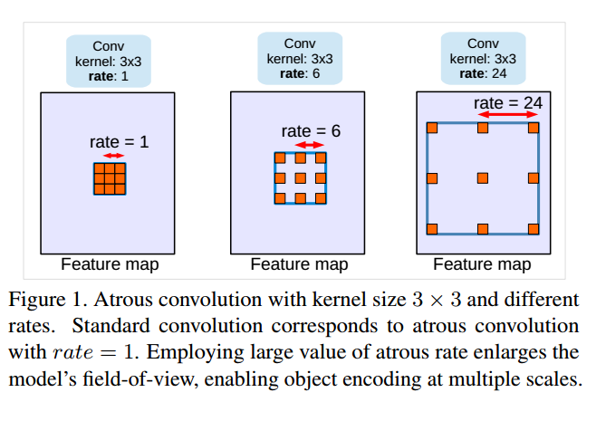

## DeepLab (v1 & v2)

* v1: （Semantic Image Segmentation with Deep Convolutional Nets and Fully Connected CRFs）
    * [paper](paper/2016-DeepLab%20v1%20Semantic%20Image%20Segmentation%20with%20Deep%20Convolutional%20Nets%20and%20Fully%20Connected%20CRFs.pdf)
* v2 : （DeepLab: Semantic Image Segmentation with Deep Convolutional Nets, Atrous Convolution, and Fully Connected CRFs）
    * [paper](paper/2017-DeepLab%20v2%20Semantic%20Image%20Segmentation%20with%20Deep%20Convolutional%20Nets,%20Atrous%20Convolution,%20and%20Fully%20Connected%20CRFs.pdf)
    
* 主要贡献：
    * 使用带孔/空洞卷积。
    * 提出金字塔型的空洞池化（ASPP）
    * 使用全连接 CRF
* 相关解释：
    * 带孔/空洞卷积在不增加参数的情况下增大感受野。如上文中空洞卷积论文中所述，分割网络得到改进。
    * 将原始图像的多个重新缩放版本传递到 CNN 网络的并行分支（图像金字塔）中，或者使用采样率不同的多个并行空洞卷积层（ASPP），实现多尺度处理。
    * 结构化预测可通过全连接 CRF 实现。CRF 的训练/微调需作为后处理的步骤单独进行。 \
    
    
* 三大挑战：
1. 分辨率减少
2. 存在多尺度目标
3. 由于空间不变性带来的定位准确度降低。

### v1

* [论文阅读理解 - Semantic Image Segmentation With Deep Convolutional Nets and Fully Connected CRFs](https://blog.csdn.net/zziahgf/article/details/78216776)
* [精读深度学习论文(20) DeepLab V1](https://zhuanlan.zhihu.com/p/36052038)

### v2

* [paper](paper/2017-DeepLab%20v2%20Semantic%20Image%20Segmentation%20with%20Deep%20Convolutional%20Nets,%20Atrous%20Convolution,%20and%20Fully%20Connected%20CRFs.pdf)
* [github code](https://github.com/jiye-ML/Semantic_Segmentation_DeepLab_v2.git)
* 
* 
* 
* [论文阅读：《DeepLab-v2: Semantic Image Segmentation 》](https://blog.csdn.net/qq_36165459/article/details/78340094)
* [多尺度问题](05.提高输出分辨率.md)
* [空间不变性带来的定位准确度降低解决方案](06_空间不变性vs定位.md)

## v3
* [paper](paper/2017-Rethinking%20Atrous%20Convolution%20for%20Semantic%20Image%20Segmentation.pdf)
* deepv3 利用两种级联空洞方法
  - 串行级联
    - 可以增加感受野，不损失空间信息，不增加参数
    - 缺点很明显，后面曲线图显示，随着rate的增加，效果变得不好，
  - 并行级联
    - 所以后面采用并行级联的方式，融合信息。
* 
* 
* 

