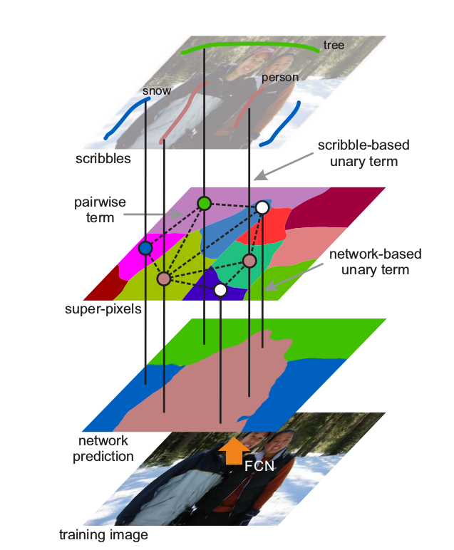
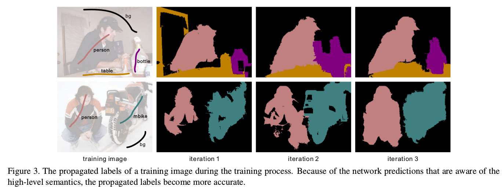

* 这篇文章提出了一种基于用户交互的图片分割训练方法(ScribbleSup)。即训练者只需要在图片上的小部分区域进行标注(scribble annotation)即可训练分割网络。如下图所示的标注方式（左图：原图；中图：传统的语义分割标注；右图：scribble annotation）：

  

### 创新 

1. **语义分割模型的弱监督训练**。和其它使用bounding box或者全图语义标注作为监督信息的文章不同，这篇文章使用的标注比较特殊，是用户的简单勾画； 
2. **交互式分割模型**。Grabcut是典型的交互式分割模型。ScribbleSup与Grabcut非常相似。可以理解为是Grabcut的延伸工作。这篇笔记就以Grabcut为出发点来理解这篇工作的思想； 
3. **自动标注工具**。用少量的人为标注（或画框，或使用画笔勾画或者标注少量的点）来得到分割标注，这也是许多自动标注工具的主要思想之一。

### 框架

### Scrrible-SUP 学习

* Task1: 该算法要从scibble传播信息到未标注的像素 方案：GrubCut

* Task2: 该算法要学习一个卷积神经网络以便进行像素级别的预测 方案：FCN
  目标函数：\(\sum_{i}\varphi (y_{i}|X,S) + \sum_{i, j}\varphi _{ij}(y_{i},y_{j}|X)\)，该目标函数包含两部分，

  * 第一项是单个超像素的一元项，第二项是关于一对超像素的pairwise 项.
  * 一元项包括两部分，第一部分基于 scribble 的信息，定义如下：

  

   	1. 第一个条件：如果一个超像素和scribble 重合，该超像素被赋予标记 c_k, cost 为0.
   	2. 第二个条件：如果一个超像素和任意的scribble 没有重合，该像素被等可能的给予任何可能的标记.

  * 第二部分是基于FCN 的网络输出，定义为 所有像素对数概率的和.$\varphi _{i}^{net}(y_{i})=-logP(y_{i}|X, \Theta )$
  * Pairwise 项建模两个超像素的相似性. 相似性在本文中用颜色和文理的直方图来量化.
  
  * 临近的超像素给予不同的标记，如果他们在颜色和纹理方面比较接近，则会有较高的 cost.

### 交替优化

### 实验结果

* Strategies of utilizing scribbles
  两阶段的方法： 基于Scribble 直接使用GrubCut, Lazysnapping 生成Masks, 然后使用 FCN 的框架训练.
* 本文方法（Mean IoU：63.1%）比两阶段的方法高 10%.
* Sensitivities to scribble quality

使用不同长度的 scribble. 结果表明该方法对 scribble 的质量是十分稳健, 特别是当 scribble 缩小到一个点时，任然有 51.6% 的score.

Comparisons with other weakly-supervised methods

Comparisons with using masks