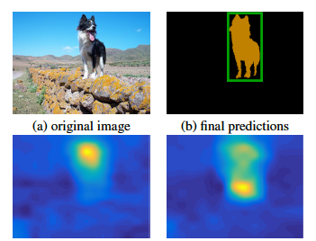
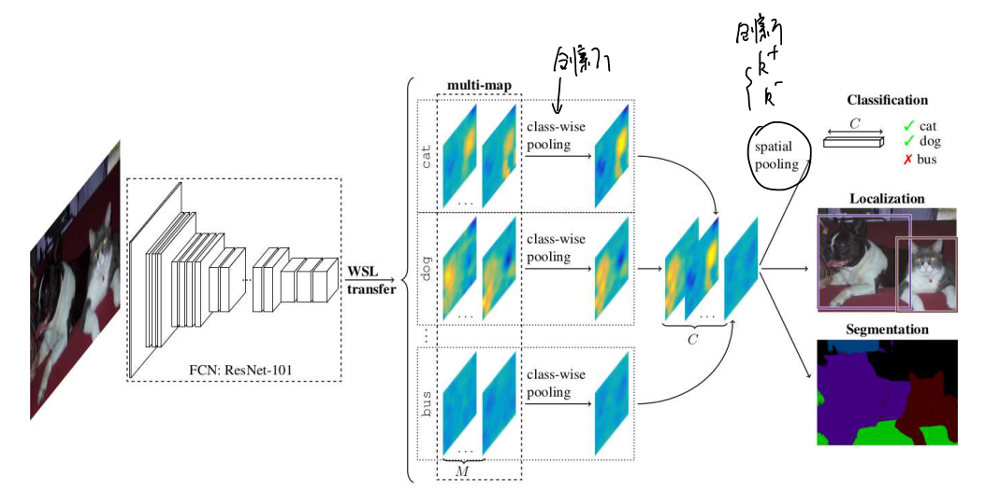
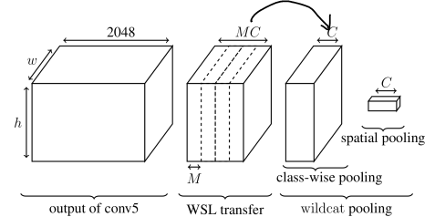

* [paper](paper/2017-WILDCAT%20Weakly%20Supervised%20Learning%20of%20Deep%20ConvNets%20for%20Image%20Classification,%20Pointwise%20Localization%20and%20Segmentation.pdf)

###  who(对谁有效)

* 弱监督
* 图像语义分割

### where

* 只有图像级标签的数据

### when

* CVPR 2017

### what（WILDCAT是什么）

* 这篇论文提出了一个框架，可以使用弱监督的方法识别一个物体显著的局部特征。
* 首先我们来直观感受下结果，如下图所示，WILDCAT可以识别狗的头部和腿部信息，从而利用这些信息来对狗进行Localization和segmentation.

* 结构

* 从上图我们可以看出，整个网络的架构分成三个部分：最左边是FCN部分，主要是用来提取feature map； 中间的部分是Multi-map transfer layer，主要是将feature map分解为多通道的特征，每个通道对应于一个显著的局部特征；最右边是Pooling操作，主要是将生成的多通道feature map aggregate 到一个值，最后使用image level的ground truth信息进行学习。下面来分别讲解这三个部分。

### how (如何实现的)

#### 1. Multi-map transfer layer

这篇文章使用1x1convolution将feature map由w x h x d 转变成 w x h x MC。 其中M代表通道的数目，代表feature map的个数； C表示类别数。

#### 2. WILDCAT Pooling

由于我们的ground truth是image label，所以需要将transfer layer的信息aggregate到image level。这个Pooling层共有两种操作：1）class-wise pooling 2)spatial pooling。

* Class-wise pooling 是针对每类，将不同通道的feature map 合成一个，其公式如下，其将w x h x MC 转变为 w x h x C。

* Spatial pooling
  * 这个Pooling有点意思，在某种意义上，它是一种general 的Pooling。是一种介于max Pooling和average Pooling之间的操作，除此之外，它还结合了 “negative evidence insight”，即使用了激活值比较低的值。其公式如下所示。其中， $K^{+}$ 表示激活值最高的k个值。$K^{-}$ 表示激活值最低的k个值。所以，最后的值与激活最高的k个值和激活最低的k个值相关，并且最后取平均数。所以，可以看出这个操作是2k个激活值的平均值。当然，α可以调节最高激活值和最低激活值之间的比例。

  

* 最后我们可以使用这个网络直接训练分类任务。同时，对于弱监督的Localization/detection， 作者使用spatial Pooling 前面的class-level feature map来生成Localization/detection的结果，使用的方法与论文Weakly supervised Localization using deep feature maps的方法类似。对于弱监督的semantic segmentation， 作者使用每个类中激活最大的值或者使用CRF最为最终的预测，方法和论文Semantic Image Segmentation With Deep Convolutional Nets and Fully Connected CRFs类似。

### why(为什么重要)

* M模型化旨在专注于不同类别的特征，
* multi-map传输模型可以找到更多的一般特征；
* 标准的max-pooling方法只能获得一个元素；我们可以获得更多；

* 我们聚集最小化分数区域来支持分类；
* 最小化和最大化区域对于结果来说都很重要，但是重要性不一样，我们加入 $\alpha$来加权；
* 对于全局平均池，两个层的顺序并不重要，但是这两个配置在非线性池功能行为可能不同，例如wildcat spatial pooling，当 $k^{+} + k^{-}$很小时，这种差异化尤其严重。

