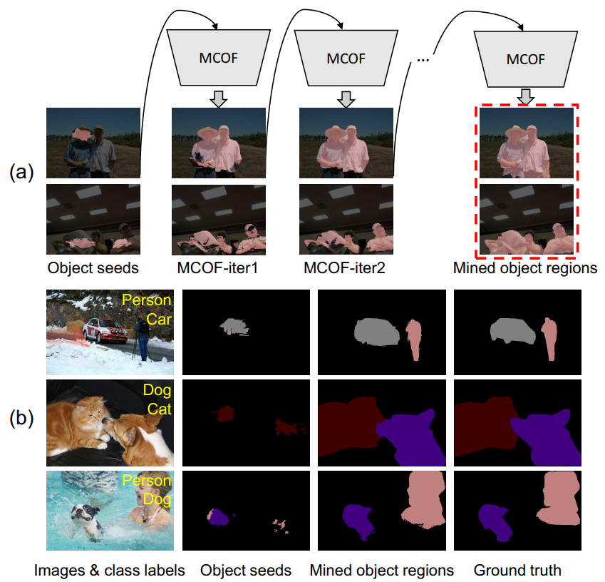
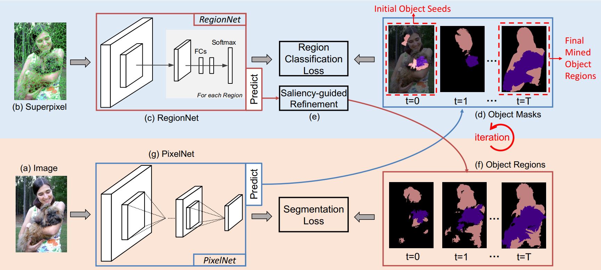
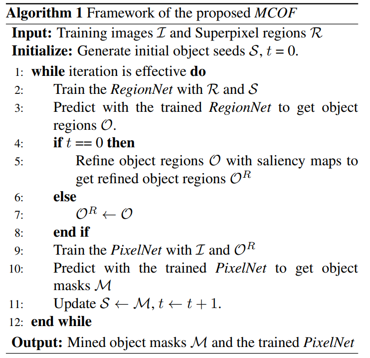
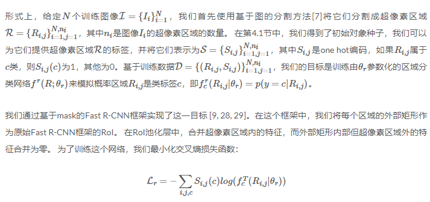
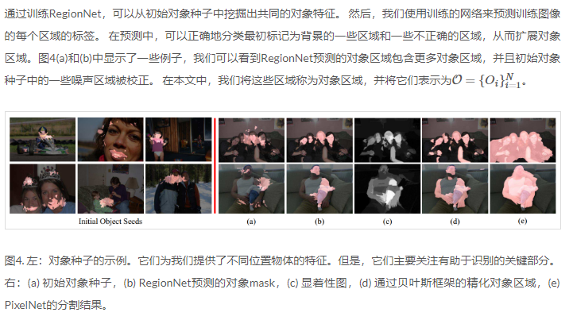
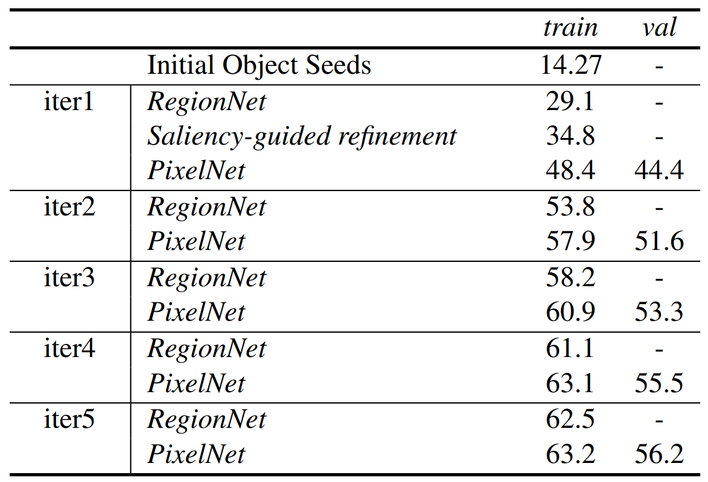

### when

- CVPR 2018

### who（影响了谁）

- 图像标签监督下的弱监督语义分割是一项具有挑战性的任务，因为它直接将高级语义与低级别外观相关联。为了弥合这一差距，在本文中，我们提出了一个迭代的自下而上和自上而下的框架，它可以扩展对象区域并优化分割网络。

### why(为什么提出)

- 弱监督的语义分割非常具有挑战性，因为它直接将高级语义与低级别外观相关联。 由于只有图像标签可用，因此大多数先前的工作依赖于分类网络来定位对象。 然而，虽然没有像素方式的标注可用，但是分类网络只能产生不准确和粗略的鉴别对象区域，这不能满足逐像素语义分割的要求，从而损害了性能。
- 为了解决这个问题，在本文中，我们提出了一个迭代的自下而上和自上而下的框架，它通过挖掘公共对象特征（MCOF）从初始定位到逐步扩展对象区域来容忍不准确的初始定位。
- **动机**，虽然分类网络产生的初始定位是粗略的，但它给出了对象的某些鉴别区域，这些区域包含关于对象的重要知识，即共同的对象特征。例如，如图1(a)所示，一些图像可以定位人的手，而其他图像可以定位头。

### where（适用范围，优点，缺点， 创新点，以前的方法）

#### 优点：

- 给定一组训练图像，我们可以从中学习共同的对象特征来预测整个对象的区域。因此，在自下而上的步骤中，我们将初始对象定位作为对象种子并从中挖掘共同对象特征以扩展对象区域。然后在自上而下的步骤中，我们使用挖掘的对象区域作为监督来训练分割网络以预测精细对象mask。预测的对象mask包含更多对象区域，这些区域更准确并提供更多对象的训练样本，因此我们可以进一步挖掘它们的共同对象特征。并且迭代地进行上述过程以逐步产生精细对象区域并优化分割网络。通过迭代，初始定位中的不准确区域被逐步校正，因此我们的方法是稳健的并且可以容忍不准确的初始定位。图1(b)显示了一些例子，其中初始定位非常粗糙和不准确，而我们的方法仍然可以产生令人满意的结果。

图1. (a) 提出的MCOF框架的图示。 我们的框架迭代地挖掘共同的对象特征并扩展对象区域。(b) 初始对象种子和我们挖掘的对象区域的示例。 我们的方法可以容忍不准确的初始定位并产生相当令人满意的结果。

#### 改进点

- 我们首先训练图像分类网络并使用分类激活图（CAM）定位对象的判别区域。
- 然后将图像分割成超像素区域并使用CAM分配类标签，这些区域称为初始对象种子。初始对象种子包含对象的某些关键部分，因此在自下而上的步骤中，我们从它们中挖掘共同对象特征，然后展开对象区域。
- 我们通过训练区域分类网络并使用训练有素的网络来预测对象区域来实现这一目标。
- 虽然这些区域可能仍然只关注对象的关键部分区域，为了补充非鉴别区域，提出了在贝叶斯框架下考虑扩展对象区域和显着图的显着引导细化方法。然后在自上而下的步骤中，我们使用精化的对象区域作为监督来训练分割网络以预测分割mask。
- 通过上述过程，我们可以获得包含更完整对象区域的分割mask，并且比初始对象种子更精确。我们进一步将分割mask作为对象种子，并迭代地进行处理。通过迭代，所提出的MCOF框架逐步产生更准确的对象区域并增强分割网络的性能。最终训练的分割网络用于预测。

#### 创新点

- 我们提出了一个迭代的自下而上和自上而下的框架，它通过迭代挖掘共同对象特征来容忍不准确的初始定位，以逐步生成精确的对象mask并优化分割网络。
- 提出了显着性引导细化方法来补充在初始定位中忽略的非鉴别区域。
- PASCAL VOC 2012分割数据集的实验表明，我们的方法优于以前的方法，并实现了最先进的性能。

#### 以前的方法：

- **全监督语义分割**：
  - 方法：全监督的方法获得大量的逐像素标注，根据过程的模式，它们可以被分类为基于区域和基于像素的网络。基于区域的网络将图像作为一组区域进行处理，并提取它们的特征以预测其标签。 Mostajabi等人提出了缩小特征，它结合了局部，近处，远处相邻超像素和整个场景的特征，对每个超像素进行分类。基于像素的网络将整个图像作为输入，并使用完全卷积层端到端地预测像素标签。 Long等人[16]提出了完全卷积网络（FCN）和跳跃架构来产生准确和详细的语义分割。 Chen等人[2]提出了DeepLab，它引了“带孔算法”，以较小的步幅扩大感受野，以产生更密集的分割。 基于FCN和DeepLab已经报告了大量的工作 [1, 18, 32]。基于像素的网络已被证明比基于区域的网络更强大，可用于语义分割。 但是，在本文中，我们采用了两种网络。 我们展示了基于区域的网络在学习对象的共同特征方面是强大的，因此可以产生精细的对象区域作为训练基于像素的网络的监督。
  - 缺点：虽然全监督的方法需要大量的逐像素标注，这是非常昂贵的
- **弱监督语义分割**:
  - 方法：最近的进展利用了弱监督的语义分割，包括边界框 [4, 19, 12]，线 [15]和图像级标签 [21, 22, 25, 19, 31, 13, 23, 30]。在本文中，我们只关注最弱的监督，即图像级监督。
    - 在图像级弱监督语义分割中，由于只有图像标签可用，大多数方法都是基于分类方法，这些方法可以粗略地分为两类：基于MIL的方法，它直接用分类网络预测分割mask；和基于定位的方法，利用分类网络产生初始定位并使用它们来监督分割网络。
    - 基于多实例学习（MIL）的方法 [21, 22, 13, 25, 5] 将弱监督学习形成为MIL框架，其中已知每个图像具有属于某个类的至少一个像素，并且任务就是要找到这些像素。Pinheiro等人[22]提出了Log-Sum-Exp（LSE）将输出特征映射池化到图像级标签中，以便可以将端到端的网络训练为分类任务。Kolesnikov等人[13]提出了全局加权池化（GWRP）方法，该方法为最后一个池化层中的更有可能的位置提供更多权重。 然而，虽然基于MIL的方法可以定位鉴别对象区域，但是它们有粗略的对象边界的问题，因此性能不令人满意。
    - 基于定位的方法 [19, 31, 13, 23, 30]旨在从弱标签生成初始对象定位，然后将其用作监督来训练分割网络。 Kolesnikov等人[13]使用分类网络生成的定位线索作为一种监督，他们还提出了分类损失和边界感知损失来考虑类和边界约束。 Wei等人[30]提出了用分类网络逐步挖掘对象区域的对抗性擦除方法。虽然Wei等人[30]也旨在从最初的定位扩展对象区域。它们依赖于分类网络来顺序地产生擦除图像中的最具鉴别力的区域。它将导致错误累积，并且挖掘的对象区域将具有粗略的对象边界。所提出的MCOF方法挖掘来自粗略对象种子的共同对象特征以预测更精细的分割mask，然后迭代地挖掘来自预测mask的特征。我们的方法逐渐扩展对象区域并校正不准确的区域，这对于噪声是鲁棒的，因此可以容忍不准确的初始定位。利用超像素的优势，挖掘的物体区域将具有清晰的边界。

### how

#### 1. 提出的MCOF的架构

- **why**：分类网络只能产生粗略且不准确的鉴别对象定位，这远远不是像素方式语义分割的要求。 为了解决这个问题，在本文中，我们认为，尽管初始对象定位是粗略的，但它包含有关对象的重要特征。 因此，我们提出从初始对象种子中挖掘出共同的对象特征，逐步校正不准确的区域，并生成精细的对象区域以监督分割网络。
- **how**：如图2所示，我们的框架包含两个迭代步骤：自下而上步骤和自上而下步骤。 
  - 自下而上的步骤挖掘来自对象种子的共同对象特征以产生精细对象区域，并且自上而下的步骤使用所产生的对象区域来训练弱监督的分割网络。 预测的分割mask包含比初始更完整的对象区域。 
  - 然后，我们将它们作为对象种子来挖掘共同的对象特征，并且迭代地进行处理以逐步地校正不准确的区域并产生精细的对象区域。

- 注意，在第一次迭代中，初始对象种子仅包含鉴别区域，在挖掘共同对象特征之后，仍然缺少一些非鉴别区域。 为了解决这个问题，我们建议将显着性图与挖掘的对象区域结合起来。 在第一次迭代之后，分割的mask包含更多的对象区域并且更准确，而显着性图的精度也是有限的，因此在稍后的迭代中，显着性映射将不再采用，这是为了防止引入额外的噪声。 整个过程总结为算法1。

#### 2. 挖掘共同对象特征

##### 从初始对象种子挖掘共同对象特征

- 为了获得初始对象定位，我们训练分类网络并使用CAM方法来生成每个对象的热力图。 如图3所示，热力图非常粗糙，用于定位对象的鉴别区域，首先，我们使用基于图的分割方法将图像分割成超像素区域并对每个区域内的热力图进行平均。 我们观察到CAM图通常具有几个中心区域，其中围绕它们具有低置信区域，并且中心区域主要是对象的关键部分。 因此，对于每个热力图，我们选择其局部最大区域作为初始种子。 然而，这可能会错过许多区域，因此也选择热图大于阈值的区域作为初始种子。 一些例子如图3所示。

##### 从初始对象种子挖掘共同对象特征：

- 初始对象种子太粗糙，无法满足语义分割的要求，但是，它们包含对象的鉴别区域。 例如，如图4所示，一个图像可以定位一个人的手，而另一个图像可以给出面部的位置。 我们认为，同一类的区域具有一些共享属性，即共同的对象特征。 因此，给定一组具有种子区域的训练图像，我们可以从中学习共同的对象特征并预测对象的整个区域，从而扩展对象区域并抑制噪声区域。 我们通过使用对象种子作为训练数据训练名为RegionNet的区域分类网络来实现这一目标。

#### 显着性引导的对象区域补充

- 注意，RegionNet是从初始种子区域学习的，这些种子区域主要包含对象的关键区域。 使用RegionNet，可以扩展对象区域，同时仍然存在一些被忽略的区域。例如，初始种子区域主要集中在人的头部和手部，而其他区域（例如身体）经常被忽略。 在通过RegionNet扩展后，身体的某些区域仍然缺失（图4(b)）
- 为了解决这个问题，我们提出通过合并具有单个对象类的图像的显着性图来补充对象区域。请注意，我们不直接使用显着性图作为初始定位，因为在以前的研究中[31]，因为在某些情况下，显着对象可能不是我们在语义分割中需要的对象类，并且显着图性本身也包含会影响定位精度的噪声区域。 一些例子如图5所示。

#### 迭代学习框架

- 精细化的对象区域为我们提供了一些可靠的对象定位，我们可以将它们作为监督来训练弱监督的语义分割网络。 虽然之前的研究依赖于定位线索和类标签来设计和训练分割网络，但在我们的工作中，我们已经删除了之前RegionNet中的错误类区域，因此精化对象区域不包含任何错误类。 因此我们只能使用定位线索作为监督，这与全监督的框架完全兼容，因此我们可以从现有的全监督架构中受益。 在本文中，我们利用流行的DeepLab LargeFOV模型[2]作为我们的分割网络的基本网络，名为PixelNet。

### why有效

#### 渐进的共同对象特征挖掘和网络训练框架

- 为了评估提出的渐进式共同对象特征挖掘和网络训练框架的有效性，我们评估了每次迭代的RegionNet和PixelNet对训练集和验证集的影响。 在模块研究中，我们使用VGG16作为PixelNet的基础网络。 结果显示在表3中。我们可以看到初始对象种子非常粗糙（在训练集上为14.27％mIoU），通过应用RegionNet来学习物体的共同特征，通过引入显着性，性能达到29.1％ - 引导细化之后，达到34.8％，在使用PixelNet学习后，它达到了48.4％。 在后来的迭代中，性能逐渐提高，这表明我们的方法是有效的。

#### 与直接迭代训练的比较

- 通过与直接迭代训练方法的比较，我们广泛地进行了实验，以验证所提出的渐进式共同对象特征挖掘和网络训练框架的有效性。 对于直接迭代训练方法，我们从第一次迭代的分割结果开始，然后在后来的迭代中，使用前一次迭代的分割mask来训练分割网络。
- 图8显示了比较。 通过迭代，直接迭代方法的性能缓慢增加并且仅达到低精度，而在所提出的MCOF中，性能快速增加并且实现更高的准确度。 该结果表明我们的MCOF框架是有效的。 MCOF逐步挖掘来自先前对象mask的共同对象特征，然后扩展更可靠的对象区域以优化语义分割网络，因此精度可以快速增加到非常令人满意的结果。

#### 显着性细化的有效性

- 初始对象种子仅定位对象的鉴别区域，例如，人的头部和手部，而其他区域（例如身体）经常被忽略。 为了补充其他对象区域，将显着性图与初始对象种子合并。 这对于挖掘整个物体区域非常重要。 为了评估有效性，我们在没有显着性引导细化的情况下对框架进行实验，并比较每次迭代的PixelNet的性能。 结果显示在表4中。如果没有结合显着性图，一些对象区域将会丢失，因此性能将受到限制并且无法达到令人满意的准确度。

表4. 评估显着性引导细化的有效性。我们在Pascal VOC 2012验证集上显示每次迭代的PixelNet的mIoU。如果没有显着性引导的细化，性能将受到限制并且无法达到令人满意的精度。

